# Healthora — Documentación de Arquitectura

Healthora es un e-commerce de farmacia/salud con catálogo real de 200 productos, carrito persistente, pagos con Stripe y panel de administración. Es un monorepo con frontend en React + Vite y backend en Hono + Bun, conectado a MongoDB Atlas.

---

## Tabla de Contenidos

1. [Vista General del Sistema](#1-vista-general-del-sistema)
2. [Estructura de Carpetas](#2-estructura-de-carpetas)
3. [Frontend](#3-frontend)
4. [Backend](#4-backend)
5. [Base de Datos (MongoDB)](#5-base-de-datos-mongodb)
6. [Autenticación (Clerk)](#6-autenticación-clerk)
7. [Pagos (Stripe)](#7-pagos-stripe)
8. [Emails (nodemailer)](#8-emails-nodemailer)
9. [Flujos Principales](#9-flujos-principales)
10. [Variables de Entorno](#10-variables-de-entorno)
11. [Cómo Levantar el Proyecto](#11-cómo-levantar-el-proyecto)

---

## 1. Vista General del Sistema

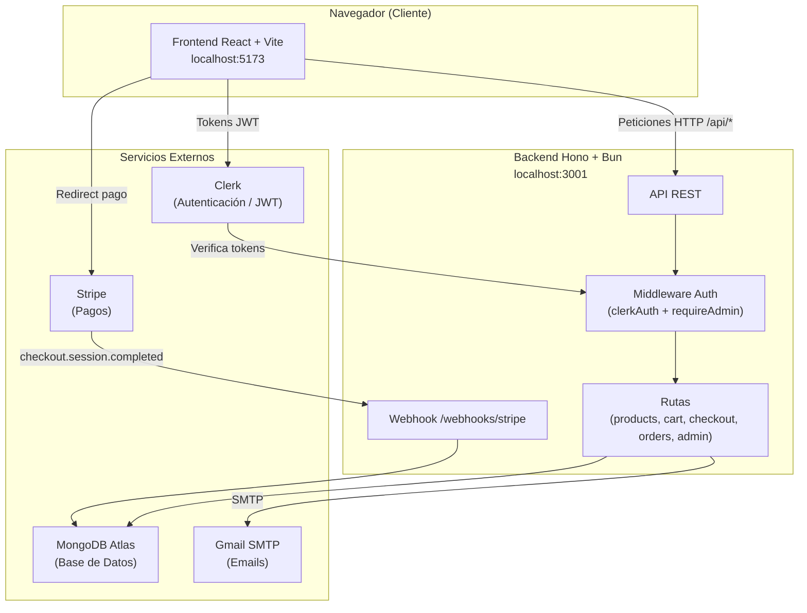

---

## 2. Estructura de Carpetas

```
Healthora/
├── backend/
│   └── src/
│       ├── index.ts              ← Punto de entrada, monta la app Hono
│       ├── db/
│       │   ├── connection.ts     ← Conexión MongoDB
│       │   ├── models/        ← Schemas Mongoose (Product, Order, User, Category, Review)
│       │   ├── seed.ts       ← Script: carga 200 productos y 10 categorías
│       │   ├── seed-orders.ts   ← Script: carga órdenes de ejemplo
│       │   └── seed-reviews.ts ← Script: carga reseñas de ejemplo
│       ├── middleware/
│       │   ├── clerkAuth.ts    ← Verifica JWT + sincroniza usuario
│       │   └── requireAdmin.ts  ← Bloquea si rol !== 'admin'
│       ├── routes/
│       │   ├── products.ts    ← Catálogo de productos
│       │   ├── categories.ts ← Categorías
│       │   ├── cart.ts     ← Carrito persistente
│       │   ├── checkout.ts  ← Crear sesión de Stripe
│       │   ├── orders.ts   ← Órdenes del usuario
│       │   ├── account.ts  ← Direcciónes guardadas
│       │   ├── webhooks.ts  ← Webhook de Stripe
│       │   ├── newsletter.ts ← Suscripción al newsletter
│       │   ├── reviews.ts  ← Reseñas de productos
│       │   └── admin/     ← Dashboard, orders, products, users, sales, earnings
│       ├── lib/
│       │   ├── clerk.ts     ← SDK de Clerk
│       │   ├── stripe.ts    ← SDK de Stripe
│       │   ├── email.ts    ← nodemailer (SMTP)
│       │   ├── orderStatus.ts ← Utilidad de normalización de estado
│       │   └── promotions.ts ← Promociones activas
│       ├── test-email.ts    ← Script de prueba de SMTP
│       └── types/         ← Tipos TypeScript compartidos
│
├── frontend/
│   └── src/
│       ├── main.tsx        ← Entry point + ClerkProvider + QueryClient
│       ├── App.tsx         ← Router, estado global, sincronización de carrito
│       ├── components/
│       │   ├── chrome/    ← Header, Footer, Topbar, SignInModal
│       │   ├── shared/   ← ProductCard, Stars, Button, Icon, ReviewSection
│       │   └── admin/    ← UI del panel de administración
│       ├── pages/
│       │   ├── Landing.tsx    ← Home con productos destacados
│       │   ├── Catalog.tsx    ← Grid de productos con filtros
│       │   ├── ProductDetail.tsx ← Vista detalle + reseñas
│       │   ├── CartDrawer.tsx  ← Carrito lateral
│       │   ├── Checkout.tsx   ← Formulario + pago Stripe
│       │   ├── Success.tsx    ← Confirmación de orden
│       │   ├── Orders.tsx     ← Historial de órdenes
│       │   ├── Club.tsx      ← Página de membresía
│       │   └── admin/AdminApp.tsx
│       ├── hooks/          ← useProducts, useCategories, useOrders, useReviews
│       ├── store/cartStore.ts ← Estado del carrito (Zustand)
│       ├── lib/api.ts     ← Cliente HTTP centralizado
│       └── types/index.ts
│
├── docs/
│   └── arquitectura.md          ← Este archivo
├── package.json                 ← Scripts raíz del monorepo
└── .gitignore
```

---

## 3. Frontend

### Stack

| Herramienta | Versión | Rol |
|---|---|---|
| React | 19.2.5 | Framework UI |
| Vite | 8.0.10 | Build tool / dev server |
| TypeScript | 6.0.2 | Tipado estático |
| React Router DOM | 7.14.2 | Navegación SPA |
| TanStack Query | 5.100.0 | Estado del servidor (caché, fetching) |
| Zustand | 5.0.12 | Estado del carrito (cliente) |
| Clerk React | 5.61.3 | Auth UI + hooks |
| Recharts | 3.8.1 | Gráficas del admin |

### Diagrama de Componentes

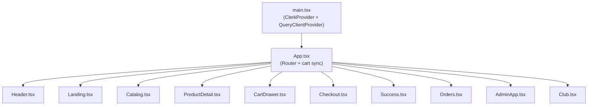

### Navegación (Rutas)

La app es SPA. Las vistas se controlan con el parámetro `?view=` en la URL.

| Vista | URL | Descripción |
|---|---|---|
| Home | `/?view=landing` | Productos destacados |
| Catálogo | `/?view=catalog` | Grid con filtros |
| Producto | `/?view=product&id=<id>` | Detalle de producto |
| Carrito | drawer lateral | Se abre desde el Header |
| Checkout | `/?view=checkout` | Formulario + pago |
| Éxito | `/?view=success` | Confirmación |
| Órdenes | `/?view=orders` | Historial de órdenes |
| Admin | `/admin` | Panel de administración |
| Club | `/club` | Membresía |
| SSO | `/sso-callback` | Callback de Clerk |

### Estado del Carrito (Zustand)

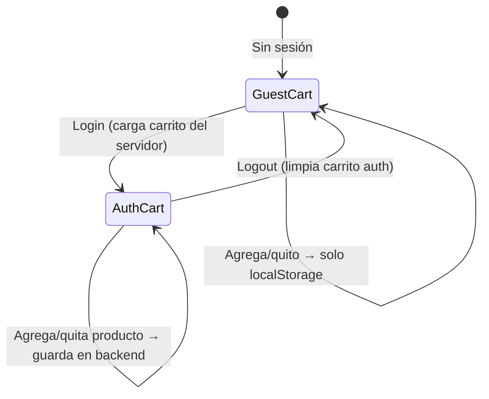

- El carrito de invitado vive en **localStorage** (Zustand persist).
- Al autenticarse, `App.tsx` llama `GET /cart` y reemplaza el estado local.
- Cada cambio dispara un **guardado debounced** a `PUT /cart`.

### Proxy de API (Vite)

```
Frontend llama: /api/products
Vite reescribe: http://localhost:3001/products
```

Configurado en `frontend/vite.config.ts`. En producción se reemplaza por la URL real del backend.

---

## 4. Backend

### Stack

| Herramienta | Versión | Rol |
|---|---|---|
| Hono | 4.12.15 | Framework web minimalista |
| Bun | — | Runtime JS (remplaza Node) |
| Mongoose | 9.5.0 | ODM para MongoDB |
| Clerk Backend | 3.3.0 | Verificación de JWT |
| Stripe | 22.0.2 | Pagos |
| nodemailer | 7.0 | Envío de emails |

### Mapa de Rutas

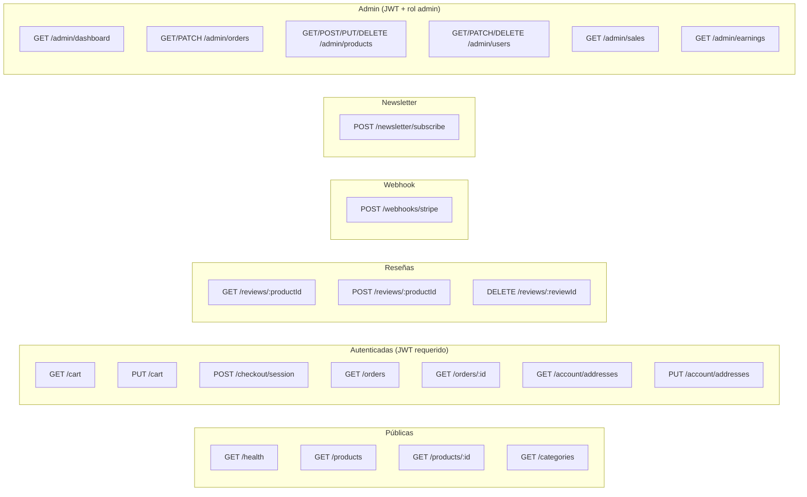

### Middleware

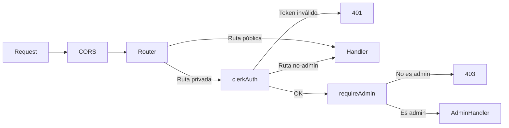

**`clerkAuth.ts`** hace dos cosas:
1. Verifica el token JWT con el SDK de Clerk.
2. Hace upsert del usuario en MongoDB (sincroniza nombre, email y rol).

**`requireAdmin.ts`** simplemente lee `c.get('user').role` y corta con 403 si no es `'admin'`.

### Cálculo de Checkout

```
subtotal = suma(precio × cantidad)
shipping = subtotal >= 50 ? 0 : 6.90
tax      = subtotal × 0.07
total    = subtotal + shipping + tax
```

---

## 5. Base de Datos (MongoDB)

### Colecciones

#### `products`
Contiene los 200 productos reales. Campos importantes:
- `id` — slug único (ej. `tylenol-extra-strength-500mg`)
- `category` — una de 10 categorías (ej. `medicamentos`, `vitaminas`, etc.)
- `need` — sub-necesidad (ej. `dolor-fiebre`, `vitamina-c`)
- `images[]` — array de URLs relativas a `/products/<category>/`
- `stock` — se decrementa al completarse una orden
- `faq[]` — preguntas frecuentes del producto
- `benefits[]`, `skinTypes[]`, `certifications[]` — arrays descriptivos
- **Reseñas**: cada producto puede tener reseñas vinculadas

#### `orders`
- `paymentStatus`: `pending_payment | paid | cancelled | refunded`
- `fulfillmentStatus`: `unfulfilled | processing | shipped | delivered | cancelled`
- `items[]`: snapshot del producto al momento de compra (nombre, precio, qty)
- `stripeSessionId`: único, usado para recuperar la orden post-pago
- `createdAt` — fecha de creación en zona horaria UTC

#### `users`
- `clerkId` — viene de Clerk, es el identificador principal
- `role`: `customer` (por defecto) o `admin` (asignado por email o metadata de Clerk)
- `cart[]`: `{ productId, qty }` — carrito persistente del usuario
- `addresses[]`: direcciones guardadas con `isDefault`

#### `categories`
10 categorías: `cuidado-bebe`, `cuidado-personal`, `fitness`, `fragancias`, `hidratantes`, `maquillaje`, `medicamentos`, `salud-piel`, `suplementos`, `vitaminas`.

#### `reviews`
- `productId` — referencia al producto
- `userId` — referencia al usuario (clerkId)
- `rating` — 1-5 estrellas
- `comment` — texto de la reseña
- `createdAt` — fecha de creación

---

## 6. Autenticación (Clerk)

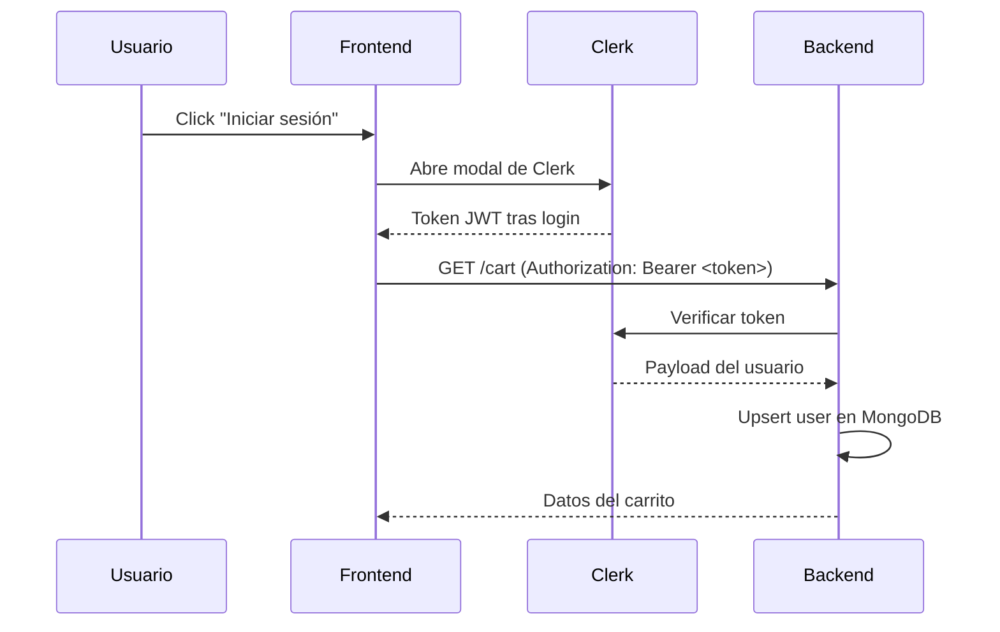

- **Emails de admin**: definidos en `ADMIN_EMAILS` del `.env`. Al hacer upsert, si el email del usuario está en esa lista, se guarda con `role: 'admin'`.
- **SSO**: la ruta `/sso-callback` en el frontend maneja el redirect de proveedores externos (Google, etc.).
- Los tokens se pasan como `Authorization: Bearer <token>` en cada petición autenticada.

---

## 7. Pagos (Stripe)

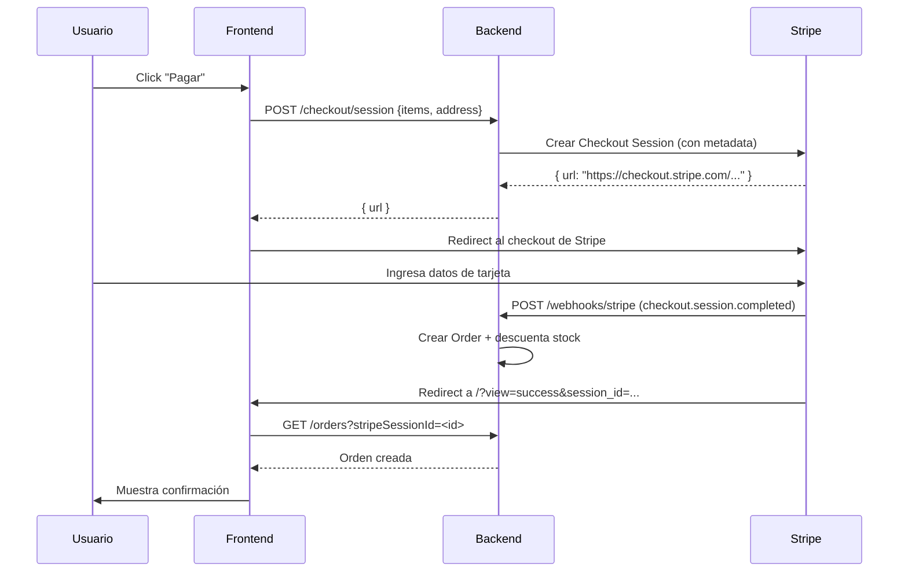

- El webhook verifica la firma de Stripe (`STRIPE_WEBHOOK_SECRET`) antes de procesar.
- La orden se crea **solo en el webhook**, nunca antes, para避免 órdenes sin pago.
- Al crear la orden, se decrementa el stock de cada producto.

---

## 8. Emails (nodemailer)

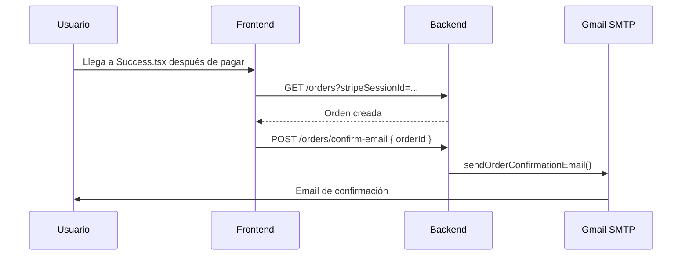

### Configuración SMTP

El backend usa **nodemailer** con SMTP de Gmail:

```env
SMTP_HOST=smtp.gmail.com
SMTP_PORT=587
SMTP_USER=tu-gmail@gmail.com
SMTP_PASS=contraseña-de-app-de-16-caracteres
SMTP_FROM=Healthora <noreply@healthora.com>
```

Para generar la contraseña de aplicación:
1. Ve a https://myaccount.google.com/security
2. Activa "Verificación en 2 pasos"
3. Busca "Contraseñas de aplicaciones" y genera una para "Correo"

### Emails enviados

- **Confirmación de Pedido**: se envía cuando el usuario llega a la página de éxito después de pagar.
- **Actualización de estado**: cuando cambia `fulfillmentStatus` (Admin actualiza la orden).
- **Newsletter**: suscripción desde el Footer.

---

## 9. Flujos Principales

### Compra Completa

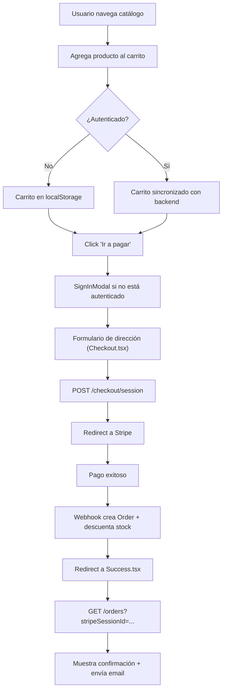

### Flujo de Admin

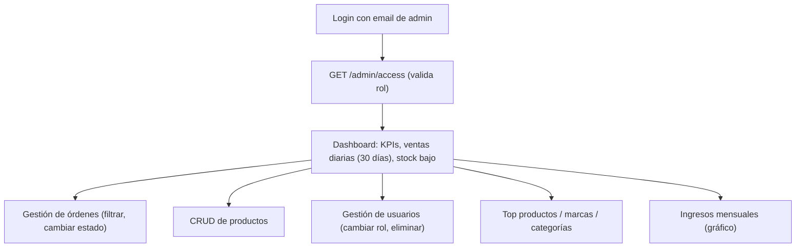

---

## 10. Variables de Entorno

### Backend (`backend/.env`)

| Variable | Descripción |
|---|---|
| `MONGODB_URI` | Connection string de MongoDB Atlas |
| `MONGODB_DB_NAME` | Nombre de la base de datos (ej. `healthora`) |
| `CLERK_SECRET_KEY` | Secret key de Clerk (`sk_test_...`) |
| `STRIPE_SECRET_KEY` | Secret key de Stripe (`sk_test_...`) |
| `STRIPE_WEBHOOK_SECRET` | Secret del webhook de Stripe (`whsec_...`) |
| `PORT` | Puerto del backend (default: `3001`) |
| `FRONTEND_URL` | URL del frontend para CORS (default: `http://localhost:5173`) |
| `ADMIN_EMAILS` | Emails con rol admin, separados por coma |
| `SMTP_HOST` | Host SMTP (ej. `smtp.gmail.com`) |
| `SMTP_PORT` | Puerto SMTP (587 o 465) |
| `SMTP_USER` | Usuario SMTP |
| `SMTP_PASS` | Contraseña de aplicación |
| `SMTP_FROM` | Remitente del email |

### Frontend (`frontend/.env`)

| Variable | Descripción |
|---|---|
| `VITE_CLERK_PUBLISHABLE_KEY` | Publishable key de Clerk (`pk_test_...`) |
| `VITE_API_URL` | URL del backend (solo en producción; en dev usa el proxy de Vite) |

---

## 11. Cómo Levantar el Proyecto

### Prerrequisitos

- [Bun](https://bun.sh/) instalado
- Cuenta en [MongoDB Atlas](https://www.mongodb.com/atlas) (cluster gratuito M0 funciona)
- Cuenta en [Clerk](https://clerk.com/) (plan gratuito)
- Cuenta en [Stripe](https://stripe.com/) (modo test)
- Cuenta de Gmail (para enviar emails)

### Pasos

```bash
# 1. Clonar e instalar dependencias
git clone <repo>
cd Healthora
bun install          # instala en raíz, frontend y backend

# 2. Configurar variables de entorno
cp backend/.env.example backend/.env
cp frontend/.env.example frontend/.env
# → Editar ambos .env con tus credenciales reales

# 3. Sembrar la base de datos (solo primera vez)
cd backend
bun run seed           # carga 200 productos + 10 categorías
bun run seed-orders   # (opcional) carga órdenes de ejemplo
bun run seed-reviews    # (opcional) carga reseñas de ejemplo

# 4. Levantar ambos servidores en paralelo (desde la raíz)
cd ..
bun run dev          # frontend en :5173 y backend en :3001
```

### Configurar el Webhook de Stripe (desarrollo)

```bash
# Instalar Stripe CLI y hacer login
stripe listen --forward-to http://localhost:3001/webhooks/stripe
# Copia el webhook secret que te da la CLI y ponlo en STRIPE_WEBHOOK_SECRET
```

### Scripts disponibles

```bash
# Raíz
bun run dev          # Inicia frontend + backend en paralelo

# Backend
bun run dev          # Inicia con hot-reload
bun run seed         # Carga 200 productos y 10 categorías
bun run seed-reviews  # Carga reseñas de ejemplo

# Frontend
bun run dev          # Vite dev server
bun run build        # Compilar para producción
bun run preview      # Preview del build
```

---

## Resumen de Tecnologías

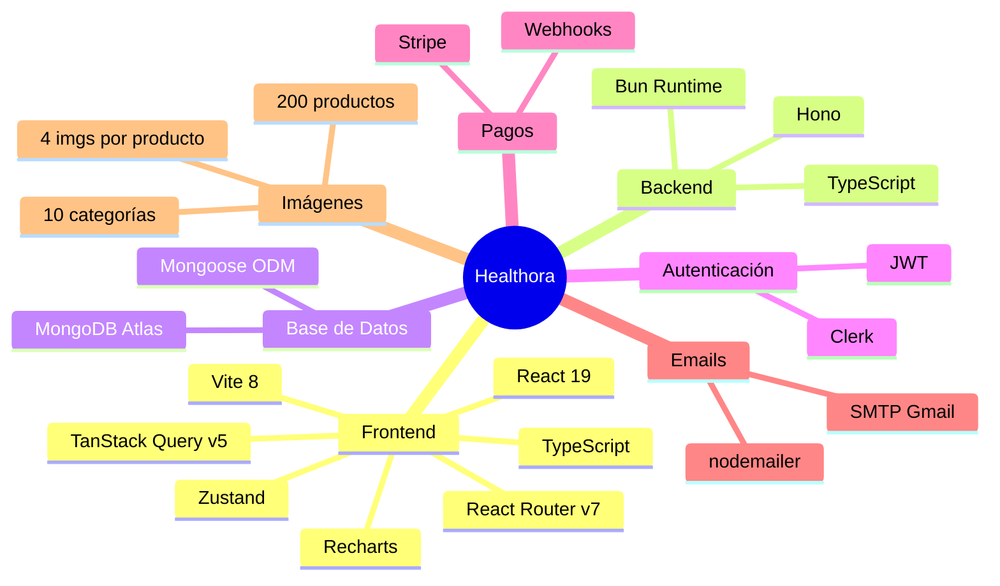